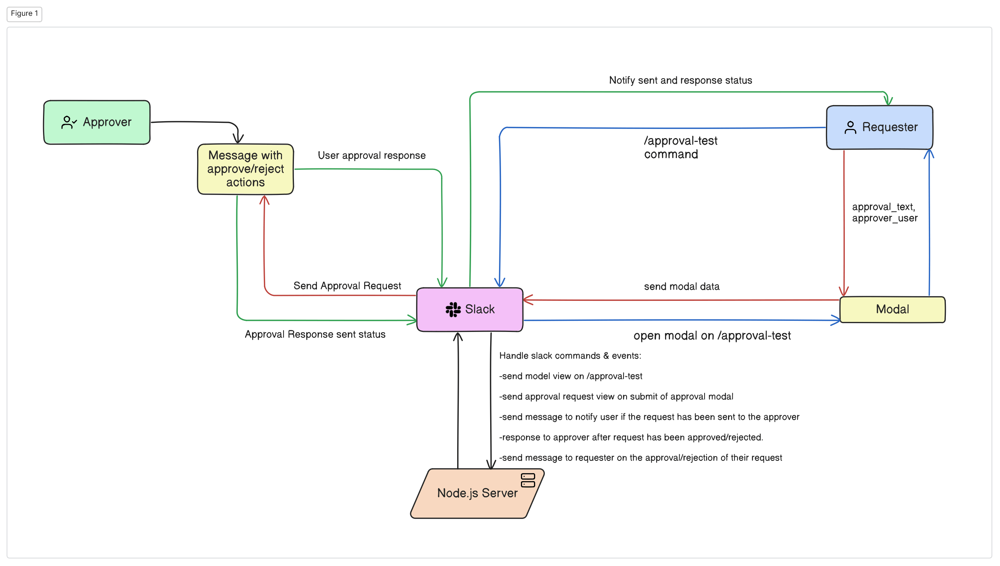

# Slack Approval Bot

## Functionality

The Slack Approval Bot allows users to create approval requests within their organization. Features include:

- Slash command: `/approval-test`
- Modal interface for submitting approval requests
- Selection of approver from Slack members
- Text area for approval description
- Submit button to send the request to the selected approver
- Approve and reject options for the approver
- Notifies the requester & approver upon approval or rejection

## Architecture Diagram

  

## Video Demo

The following are video demos for the bot, from the approver and requester prespective

### Approver

Click on here to view vide: https://streamable.com/e/wpw3zi?

## Requester

Click on here to view vide: https://streamable.com/e/d3qqbt?

## Running Locally

1. Clone the repo: `git clone https://github.com/kror-shack/slack-approval-bot`

2. Install dependencies `npm install`

3. Add your values for the following envs:

- `SLACK_BOT_TOKEN`
- `SLACK_SIGNING_SECRET`
- `PORT`

3. Start the development server: `npm run dev`

4. Go to [http://localhost:3000](http://localhost:3000) in your browser.

## Testing

To run tests, use the following command:

`npm run test`

_Built with Node.js and Express_
